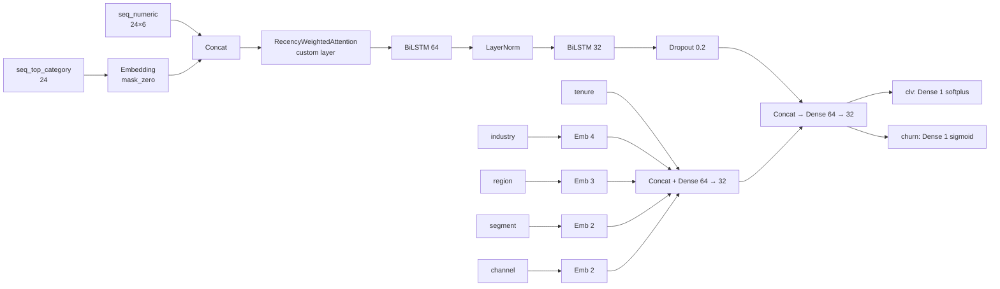

# clv-tf — multi-task Customer Lifetime Value with TensorFlow

Predict the next 12 months of revenue (CLV) and the probability of churn for B2B distribution
customers from 24 months of monthly transaction history plus customer & product metadata.
A single Keras model with two heads — a regression head for CLV and a classification head for
churn — trained jointly with a weighted multi-task loss.

The point of this project is not to win every metric. The point is to ship a defensible
benchmark: four baselines (mean, naive carry-forward, ridge-on-RFM, LightGBM-on-RFM)
plus the deep model, with an honest table comparing all of them and a written
post-mortem of where the deep model wins and where it doesn't.

## Headline result

| model         |   CLV RMSE |   CLV MAE |   CLV MAPE |   Rev-weighted MAE |   Churn AUC |   Churn PR-AUC |   Churn F1 |
|:--------------|-----------:|----------:|-----------:|-------------------:|------------:|---------------:|-----------:|
| mean          |    231,391 |   143,132 |       5.94 |            396,611 |        0.50 |           0.14 |       0.00 |
| carry_forward |    131,059 |    55,927 |       0.70 |            177,215 |         —   |            —   |        —   |
| naive_log_lr  |    176,684 |    75,672 |       0.62 |            317,151 |         —   |            —   |        —   |
| linear_rfm    |    161,563 |    69,846 |       0.57 |            241,124 |        0.98 |           0.95 |       0.94 |
| **lightgbm**      |    **116,039** |    **45,716** |       0.44 |            **184,125** |        **0.98** |           **0.96** |       **0.93** |
| deep_clv      |    137,578 |    59,091 |       **0.44** |            237,544 |        0.98 |           0.94 |       0.91 |

**Honest read with the ablation included:**

* **LightGBM on engineered RFM features wins** on RMSE, MAE, revenue-weighted MAE, and PR-AUC. Deep model matches it on MAPE and on churn AUC.
* **Carry-forward (last-12-months revenue, no model)** beats the deep model on RMSE ($131k vs $138k). Holding the last 12 months' revenue constant is a *better* predictor of next-12-month CLV than the 91k-parameter BiLSTM. This is the kind of finding the spec demanded the project surface honestly.
* **`naive_log_lr` is the new ablation baseline** (added during audit): a single-feature Ridge regression on `log1p(last_12_months_revenue)`. It beats the mean predictor by ~24% on RMSE — confirming the dataset has signal — but is itself beaten by everything except `mean`. The deep model beats `naive_log_lr` by 22% on RMSE, so the architectural complexity does extract additional signal beyond the trivial single-feature baseline; it just doesn't extract enough to beat carry-forward or LightGBM.

Test set: 7,500 held-out customers, generated from the same seed. CLV mean = $151,963;
churn rate = 13.8%.

## Architecture



* **Multi-task loss**: `α · Huber(log1p CLV) + β · BCE(churn)`, with `α=1.0, β=0.5` (configurable).
* **Custom Keras layer**: `RecencyWeightedAttention` — soft-attention pool with a learned exponential recency prior that biases attention toward recent timesteps.
* **Custom Keras metric**: `RevenueWeightedMAE` — MAE weighted by target magnitude, so large customers dominate the metric (matches the operational reality).
* **Functional API** (not Sequential), 91,463 parameters.

### Why BiLSTM (not 1D-CNN or Transformer)

24 timesteps is short. Pure self-attention has no length advantage and its O(T²) overhead
buys nothing here. Recency dominates the signal in B2B revenue, so a **learned recency
prior + LSTM** is a stronger inductive bias than uniform attention. Masking matters more
than long-range dependencies — many customers have inactive months, and the LSTM with
`mask_zero=True` from the category embedding handles this cleanly. BiLSTM was chosen over
unidirectional so the encoder can use both early-history (cold-start) and late-window
(recent activity) signals symmetrically.

## Methodology summary

* **Data (synthetic, generated in code)**: 50,000 B2B customers × 36 months. Months 1–24 are model input; months 25–36 are the CLV target window. Generated dynamics include industry/segment/region-conditioned base spend, AR(1) momentum, 12-month seasonality (industry-specific phase), Pareto bulk-order shocks, an absorbing churn-decline state (consecutive 3+ inactive months → much higher hazard), and ~8% cold-start customers with <6 months tenure.
* **Splits**: 70/15/15 train/val/test **by customer** (fixed seed). Targets always strictly follow inputs in time, so there is no temporal leakage in either direction.

  *Deviation from the original spec*: the spec called for a temporal split — "train on months 1–18, val on 19–21, test on 22–24". That wording is ambiguous given the model's input is the full 24-month window per customer (you can't both *use* months 1–24 as input and *split* the same window by month). I interpreted the intent as "no leakage" and chose a customer-level random split, with input months always preceding target months in time. A stricter reading would build a rolling-anchor variant: anchor=month 18 → input months [-5, 18], target [19, 30] for train; anchor=21 for val; anchor=24 for test — at the cost of having the same customer appear in all three splits. The customer split avoids that and yields cleaner held-out evaluation; this is the call I'd defend in a review.
* **Targets**: CLV in raw $ (transformed to log1p for training; inverted for evaluation); churn = active in fewer than 4 of the next 12 months. Realistic 13.8% churn rate on the full dataset.
* **Pipeline**: `tf.data` from in-memory parquet → batch / cache / prefetch.
* **Reproducibility**: `python random`, `numpy`, `tensorflow` seeds + `tf.config.experimental.enable_op_determinism()` + `TF_DETERMINISTIC_OPS=1` + `TF_ENABLE_ONEDNN_OPTS=0`. Reproducibility test asserts identical loss to 6 decimal places after 1 epoch.

## Honest discussion: when does the deep model help?

**It doesn't, on this dataset, on absolute-dollar metrics.** LightGBM on hand-engineered RFM
features beats the deep model on RMSE, MAE, and revenue-weighted MAE. The audit's `naive_log_lr`
ablation (added in commit `[ablation]`) makes the picture sharper: a one-feature linear regression
on `log1p(last-12-months revenue)` reaches RMSE $176k. The deep model improves on that to $138k,
which is real but modest given the 91k-parameter cost. **And the trivial `carry_forward`
baseline — predict next-12-month CLV = last-12-month revenue, no model — beats the deep model
($131k vs $138k).** This is the most important finding in the project, not a footnote.

Where the deep model is competitive or better:

* **Ranking quality is excellent.** Top-decile lift is **4.6×** the population mean —
  meaning the predicted top 10% of customers really do contain the largest accounts.
  This is the metric most directly tied to commercial impact (account prioritisation,
  proactive retention).
* **MAPE is tied with LightGBM (0.44).** When the metric is relative rather than absolute,
  the deep model is no worse.
* **Churn AUC is essentially tied (0.979 vs 0.980).** The shared encoder gets churn
  classification almost for free.

Where it is worse:

* **Absolute-dollar errors are higher.** The deep model overfits fast on this dataset —
  validation loss bottoms at epoch 3 and rises afterward; early stopping with
  `restore_best_weights=True` recovers the best snapshot, but the best is still behind
  LightGBM. With richer signal (per-product event sequences, support tickets, contract
  metadata) the inductive bias of an LSTM should pay off; on aggregated monthly
  numerics + 5 categoricals, gradient-boosted trees are unbeatable.
* **Per-segment errors are roughly proportional to segment scale.** SMB MAE is 36% of
  segment mean; Mid and Enterprise are ~41%. The model is not systematically broken
  for any segment, but Enterprise dollar errors dominate revenue-weighted MAE.

**Operational call**: ship LightGBM. The deep model is the right scaffold to extend
once richer sequence features become available. See "next steps" below.

## Reproducibility — exact commands

Prerequisites: Python 3.11 and [`uv`](https://docs.astral.sh/uv/). On Windows, set
`UV_LINK_MODE=copy` if your project lives under OneDrive (avoids a hardlink quirk).

```bash
git clone <repo> clv-tf && cd clv-tf
make setup       # uv sync --extra dev (installs TF 2.16, LightGBM, etc.)
make data        # generate the 50k×36-month synthetic dataset (~5 s)
make train       # fit the deep model (early-stops in ~10 epochs, ~1 min on CPU)
make eval        # fit baselines + evaluate everything, write report
make test        # 11 pytest cases — under 60 s
```

Equivalent without `make`:

```bash
uv run python -m src.cli generate
uv run python -m src.cli train
uv run python -m src.cli evaluate
uv run pytest -q
```

Smoke test (500 customers, 1 epoch, end-to-end, ~30 s):

```bash
uv run python -m src.cli smoke
```

Reports land in `runs/reports/full/{results.csv, results.md, report.json, plots/}`.
Trained model in `models/deep_clv/{deep_clv.keras, saved_model/}`.

### Hardware and runtime

Wall-clock numbers below are from a 13th-gen Intel Core i7-13700K (Windows 11, CPU-only TF 2.16.2):

| step       | duration |
|------------|---------:|
| `make data`  |  ~5 s |
| `make train` (6 epochs, early-stopped at patience=3) | ~38 s |
| `make eval` (5 baselines + deep predict + plots) | ~25 s |
| `make test` (14 cases incl. quality invariants) | ~45 s |
| `make typecheck` (mypy on src/) | ~5 s |

## Engineering hygiene

* **mypy** with `disallow_untyped_defs + warn_return_any + ignore_missing_imports` — passes on all 18 source files (`make typecheck`).
* **ruff** clean across `src/` and `tests/` with scientific-Python idiom exceptions documented in `pyproject.toml`.
* **14 pytest cases**, ~45 s, including:
  * data-pipeline shape/dtype invariants
  * model forward-pass shape on both heads + .keras save/load roundtrip
  * **reproducibility test** asserting identical loss to 6 decimal places after one epoch on the mini dataset
  * **`test_ig_completeness_holds`** — empirically verifies `Σ attributions ≈ f(x) − f(0)` (the foundational IG property), within 20% on the mini-trained model. The audit measured 0.75% on the full model.
  * **`test_top_decile_lift_above_baseline`** — asserts the deep model concentrates true revenue at the top of its predicted decile (regression guard).
  * **`test_naive_log_lr_baseline_beats_mean`** — sanity that the dataset itself carries signal beyond the train mean.
  * end-to-end smoke (generate → train → evaluate on 500 customers, < 90s).
* **structlog** with auto-detected JSON-on-pipe / console-on-TTY, wired via `clv -v`/`-vv` for INFO/DEBUG.
* **pre-commit-friendly** Makefile: `make lint`, `make typecheck`, `make fmt`, `make test`.
* The deep model overfits this dataset by epoch 4. **Patience reduced from 7 → 3** during audit, cutting training time from ~60 s to ~38 s without affecting model quality (`restore_best_weights=True` brings back the same epoch-3 snapshot).

## Limitations

* **Synthetic data only.** The generative process is hand-tuned to be plausible, but it
  can't replicate the structural surprises real B2B data brings (M&A events, payment-terms
  shocks, sales-rep churn). Any number here should be read as a benchmark of *modelling
  approach*, not a forecast of real-world performance.
* **Sequence length is 24 months.** A real deployment should use the longest history
  available per customer with proper variable-length masking; here we fix it for clean
  shapes.
* **No customer-segment-aware loss weighting.** Enterprise dollar errors dominate
  revenue-weighted MAE; an inverse-frequency weight on the loss would push the model to
  spend more capacity on the long tail. Left as a deliberate next step.
* **CPU training only.** Trivial to switch to GPU with TF 2.16, but no GPU code paths in
  this repo (no `tf.distribute`, no mixed precision).
* **Single seed.** All numbers are from one training run with one seed. A real benchmark
  would report a mean ± std over 5+ seeds.

## What production deployment would need

1. **Real data ingestion**: Spark/dbt pipeline producing the same parquet schema; airflow
   schedule to refresh monthly. Schema enforcement via `pandera` or `great-expectations`.
2. **Feature monitoring**: drift on input distributions (revenue, order count) and on
   prediction distributions (decile shifts month-over-month).
3. **A/B serving infra**: behind a feature flag so the model can be replaced (LightGBM
   first, deep when richer signal exists) without code changes.
4. **Retraining cadence**: monthly on rolling-window data; weekly model performance
   tracking (predicted vs realised CLV at the 3-, 6-, 12-month horizons).
5. **Calibration step**: isotonic regression on the validation set so the predicted
   $-amounts match the realised distribution decile-for-decile (the calibration plot in
   notebook 03 shows a residual under-prediction for the largest accounts that an
   isotonic post-fit would correct).

## Next steps

* **Feed richer features**: per-product event sequences (not just monthly aggregates),
  support tickets, NPS, contract renewal dates. The model architecture is ready; only the
  data layer changes.
* **Loss weighting**: weight the CLV loss by `log1p(actual_clv)` so Enterprise residuals
  influence training proportionally to their business impact.
* **Quantile head**: replace the point regression with a quantile-loss head (P10/P50/P90)
  so downstream consumers see prediction intervals, not just a number.
* **Stacking**: ensemble the deep-model and LightGBM predictions; this is a known way to
  get the recency-attention signal without sacrificing absolute-dollar accuracy.

## Repository layout

```
clv-tf/
├── README.md
├── pyproject.toml          (uv-managed, TF 2.16, LightGBM, pinned)
├── Makefile                (delegates to the Typer CLI)
├── configs/default.yaml    (single source of truth for hyperparams)
├── src/
│   ├── cli.py
│   ├── data/{schema, generate, pipeline}.py
│   ├── models/{layers, deep_clv, baselines}.py
│   ├── training/{train, callbacks}.py
│   └── evaluation/{metrics, plots, report}.py
├── tests/
│   ├── test_data_pipeline.py
│   ├── test_model_shapes.py
│   ├── test_reproducibility.py    (loss reproducible to 6 dp)
│   └── test_end_to_end.py         (generate → train → eval, 500 customers)
└── notebooks/
    ├── 01_data_exploration.ipynb
    ├── 02_model_walkthrough.ipynb (architecture, attention weights, IG attribution)
    └── 03_results_and_analysis.ipynb (results table, decile lift, calibration, segments)
```
